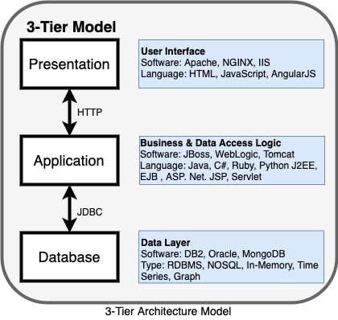
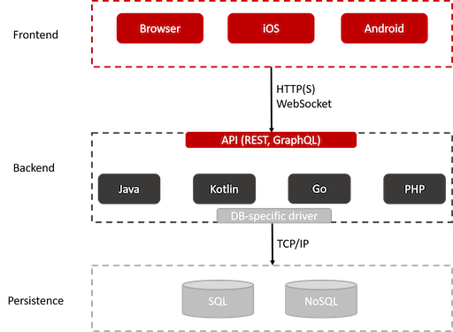

# **Three-Tier Architecture**
---

## **What is three-tier architecture?**

Three-tier architecture, which **separates** applications into **three logical** and physical computing tiers, is the predominant software architecture for traditional client-server applications.

Three-tier architecture is a well-established software application architecture that organizes applications into three logical and physical computing tiers: the **presentation tier**, or **user interface**; the **application tier**, where data is processed; and the **data tier**, where the data associated with the application is stored and managed.

The chief benefit of three-tier architecture is that because **each tier** runs on **its own infrastructure**, each tier can be **developed simultaneously** by a separate development team, and can be updated or scaled as needed without impacting the other tiers.

For decades three-tier architecture was the prevailing architecture for client-server applications. **Today, most three-tier applications are targets for modernization**, using **cloud-native** technologies such as **containers** and **microservices**, and for migration to the **cloud**.

## **The three tiers in detail**

### **Presentation tier**

The presentation tier is the **user interface** and communication layer of the application, where the **end user interacts with the application**. Its main purpose is to **display information** to and collect information from the user. This top-level tier can run on a **web browser**, as **desktop application**, or a **graphical user interface (GUI)**, 

for example. Web presentation tiers are usually developed using **HTML, CSS and JavaScript**. Desktop applications can be written in a variety of languages depending on the platform.

## **Application tier**

The application tier, also known as the **logic tier** or **middle tier**, is the heart of the application. In this tier, information collected in the presentation tier is processed - sometimes against other information in the data tier - using **business logic**, a specific set of **business rules**. The application tier can also add, delete or modify data in the data tier.

The application tier is typically developed using **Python, Java, Perl, PHP or Ruby**, and communicates with the data tier using **API calls**. 

## **Data tier**

The data tier, sometimes called **database tier**, data access tier or back-end, is where the **information** processed by the application is **stored and managed**. This can be a relational database management system such as **PostgreSQL, MySQL, MariaDB, Oracle, DB2, Informix or Microsoft SQL Server, or in a NoSQL Database server such as Cassandra, CouchDB or MongoDB.**

In a three-tier application, all communication goes through the application tier. **The presentation tier and the data tier cannot communicate directly with one another.**

## **Tier vs. layer**

In discussions of three-tier architecture, layer is often used interchangeably – and mistakenly – for tier, as in 'presentation layer' or 'business logic layer.' 

They aren't the same. A **'layer' refers to a functional division of the software**, but a **'tier' refers to a functional division of the software that runs on infrastructure separate from the other divisions**. The Contacts app on your phone, for example, is a three-layer application, but a single-tier application, because all three layers run on your phone.

The difference is important, because layers can't offer the same benefits as tiers.

## **Benefits of three-tier architecture**

Again, the chief benefit of three-tier architecture its logical and physical separation of functionality. **Each tier can run on a separate operating system and server platform** - e.g., web server, application server, database server - that best fits its functional requirements. And **each tier runs on at least one dedicated server hardware or virtual server**, so the services of each tier can be customized and optimized without impact the other tiers. 

Other benefits (compared to single- or two-tier architecture) include:

- **Faster development**: Because each tier can be developed simultaneously by different teams, an organization can bring the application to market faster, and programmers can use the latest and best languages and tools for each tier.
- **Improved scalability**: Any tier can be scaled independently of the others as needed.
- **Improved reliability**: An outage in one tier is less likely to impact the availability or performance of the other tiers.
- **Improved security**: Because the presentation tier and data tier can't communicate directly, a well-designed application tier can function as a sort of internal firewall, preventing SQL injections and other malicious exploits.

## **Three-tier application in web development**

In web development, the tiers have different names but perform similar functions:

- The **web server** is the presentation tier and provides the user interface. This is usually a web page or web site, such as an ecommerce site where the user adds products to the shopping cart, adds payment details or creates an account. The content can be static or dynamic, and is usually developed using HTML, CSS and Javascript .
- The **application server** corresponds to the middle tier, housing the business logic used to process user inputs. To continue the ecommerce example, this is the tier that queries the inventory database to return product availability, or adds details to a customer's profile. This layer often developed using Python, Ruby or PHP and runs a framework such as e Django, Rails, Symphony or ASP.NET, for example.
- The **database server** is the data or backend tier of a web application. It runs on database management software, such as MySQL, Oracle, DB2 or PostgreSQL, for example.

## **Example 3-tier Architecture**
---

### **Frontend Tier**

The Frontend is also known as the User Interface (UI) and represents what a user sees and interacts with. This tier often consists of a Webapp for **browser-based access** (Chrome, Edge, Firefox) and native apps such as **Android** and **iOS**. These clients communicate with the Backend Tier mostly through **HTTP(S)** and/or a **WebSocket** protocol .

A web app is usually built with a JavaScript Framework: React, Angular, Vue and Svelte are some of the most popular ones.

The development of native Android Apps requires **Google’s** development tools: **Kotlin, Android Studio, Play Store**. The development of native **iOS** Apps requires Apple’s development tools: **Swift, Xcode, App Store**. But there are also **cross-platform** frameworks to help speeding up the development process: **Flutter, Reactive Native, Vue Native**, most of which utilize JavaScript to build apps that are independed of the operating system and run on both Android and iOS.

### **Backend Tier**

The Backend tier is often implemented with a **general-purpose language** such as **Java, Kotlin, Go, Python, PHP** just to name a few. This tier represents the **business logic** of the application. It enforces business rules and prescribes how objects interact with each other. Hence its tasks are for **example**: **controlling the order of executions**, **computing and calculations**, **transaction management**, **composition of services** and plenty more.

Furthermore, in order to enable the **communication** between **Frontend** and **Backend**. The backend must offer an **API**. **REST** or **GraphQL** are two most common ways of how to design **backend APIs**. These APIs can be accessed via **HTTP(S)** for client request-based communication or **WebSocket** for full-duplex real-time **TCP** communication.

Some of the most popular frameworks to build backend systems are **Spring Boot (Java, Kotlin)**, **Express NodeJS (JavaScript)** or **Gin (Go)**.

Once the client request is processed, the state of our application must be **persisted**. This is where a **database specific driver** comes in handy. It abstracts and facilitates the communication between our backend and our persistence tier. This way, we do not have to reinvent the wheel each time and worry about all the low-level technical details.

### **Persistence Tier**

This is **where the data is stored**. There are plenty of database technologies out there. However, broadly speaking, we can divide them into two categories: **structured data (SQL)** and **unstructured data (NoSQL)**. The choice really depends on the application’s requirements as each technology always comes with pros and cons.

Some popular representatives for **NoSQL databases are MongoDB**, **CouchDB**, **Redis**, **Neo4J**. **PostgreSQL**, **MySQL**, **DB2**, **OracleDB** are some of the prominent SQL databases.

## **React + Spring Boot + PostgreSQL CRUD Application Architecture**
---

we will learn how to build a CRUD full-stack application using **React** as frontend and **Spring boot** as backend. We will use the **PostgreSQL** database.

**What is React JS? (Presentation tier)**

- React is used to build user interfaces (UI) on the front end.
- React is not a framework (unlike Angular, which is more opinionated). React is a JavaScript library.
- React is an open-source project created by Facebook.

**What is Spring Boot? (Application tier)**

**Spring Boot** is an opinionated framework that helps developers build Spring-based applications quickly and easily. **The main goal of Spring Boot is to quickly create Spring-based applications without requiring developers to write the same boilerplate configuration again and again**.

**What is PostgreSQL? (Data tier)**

PostgreSQL is an advanced, enterprise-class, and open-source **relational database system**. PostgreSQL supports both SQL (relational) and JSON (non-relational) querying.

**What we will build?**

We will build a basic Employee Management Application with CRUD features:

- Create Employee
- List Employee
- Update Employee
- Delete Employee
- View Employee

>Source https://github.com/hanattaw/ReactJS-Spring-Boot-CRUD-Full-Stack-App.git

